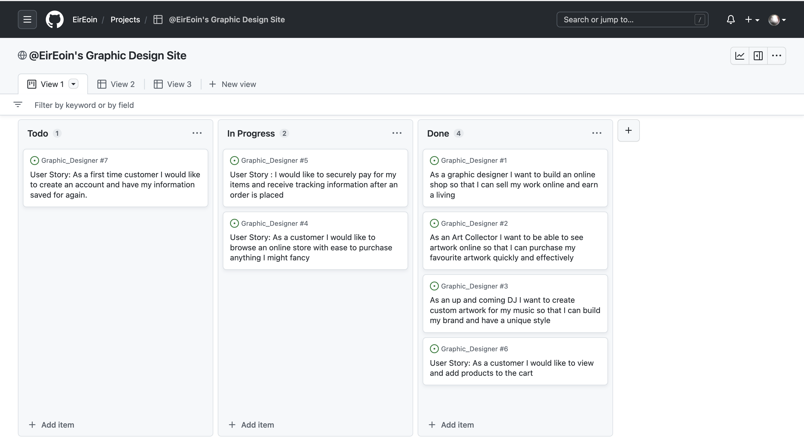
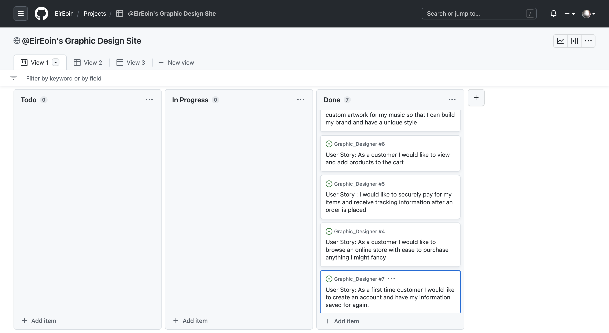
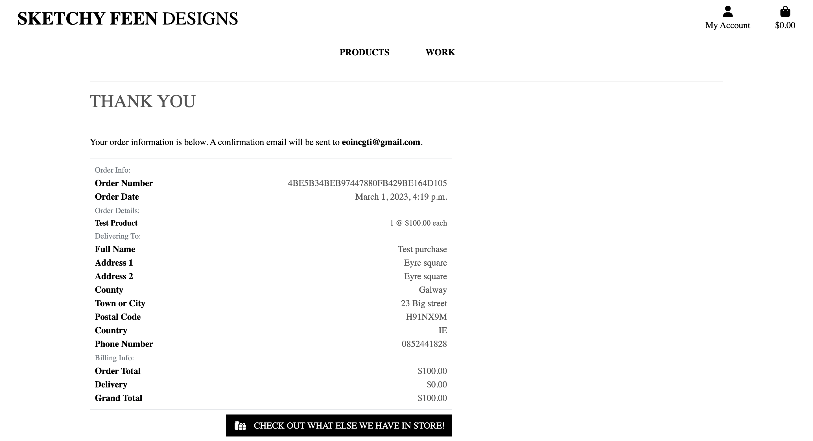
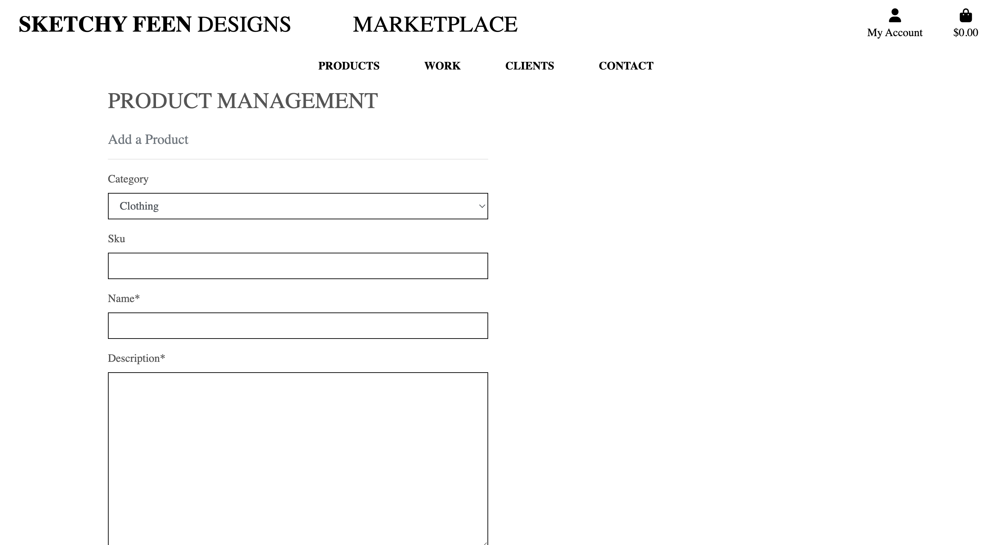

# Sketchy Designs

Welcome to my Graphic Design online store, Sketchy Designs! It is a fictional team of creative professionals dedicated to providing high-quality design services and products to individuals and businesses. It is also B2C designed and implemented with Django, Python, HTML, and CSS. It aims to provide an easy-to-use interface where customers can browse all our items. A lot of the Artwork and Designs on the website is actually my own so please, 
enjoy! 

# UX

## Goals
 
### User goals

* As a User I want to browse and have the option to purchase items directly from the site
* As a User I want to view a Gallery of previous works
* As a User I want more way to view items through social media platforms
* As a User I want to be able to create and account, add items to my basket and checkout

### Admin Goals

* As an Admin I want to be able to add to my Gallery
* Admins are able to add products easily
* As an Admin I also want to manage orders easily and securely

### Developer Goals

* As a Developer I want to produce and maintain and develop a high performing, secure webstore 
* As a Developer I aim to make the checkout process as streamlined and user-friendly as possible
* As a Developer I want to Implement Customer feedback in some way to continually improve the User experience

## User stories 

### User

* As a first time customer I would like to create an account and have my information saved for again
* As an Art Collector I want to be able to see artwork online so that I can purchase my favourite artwork quickly and effectively
* As an up and coming DJ I want to purchase and create custom artwork for my music so that I can build my brand and have a unique style 
* As a customer I would like to view and add products to the cart
* As a customer I would like to securely pay for my items and receive tracking information after an order is placed
* As a customer I would like to browse an online store with ease to purchase anything I might fancy

### Admin
* As a graphic designer I want to build an online shop so that I can sell my work online and earn a living
* As an Admin i want to be able to add products easily

## Design

### Fonts 

I chose to use Lato as the font for Sketchy Designs for a few reasons. Firstly, Lato is a clean and modern sans-serif font that is easy to read and looks great on both desktop and mobile devices. It has a balanced and neutral appearance that makes it versatile enough to use across different sections of our webstore, from headings to body text. Overall, I believe that Lato's combination of readability, versatility, and accessibility make it an excellent choice for our e-commerce webstore.

### Colours 

I chose to use a simple black and white color scheme for our webstore because it provides a clean and timeless backdrop for our products and artwork. This color scheme is particularly well-suited for my project because the background is composed of previous artwork and as for say future goals, it will hopefully keep changing as new art is added in the future. By using black and white, we are able to create a neutral and versatile background that complements our colorful products and artwork perfectly. 

This allows our products to stand out and take center stage, without competing with a busy or distracting background.

It is easy to read and visually appealing on both desktop and mobile devices, ensuring that our webstore is accessible and user-friendly for all customers.

# Wireframes

# Features 

Sketchy Designs features a clean and modern design that makes it easy for customers to browse and purchase our design services. The home page provides an overview of what we offer, including our specialties and process, as well as a featured work section to showcase some of our best design projects.

## Home Page

* The home page features a clean and simple design, with a focus on showcasing our latest products and artwork.
* A Mailchimp email signup form is prominently displayed on the home page, allowing visitors to sign up for updates and be notified about future sales, releases, or holiday discounts.

## Products Page

* The products page allows customers to browse our collection of artwork and products, with high-quality images and detailed descriptions of each item.
* Customers can securely purchase products using Stripe payment processing, ensuring a seamless and reliable checkout experience.

## Gallery 

* The gallery page features a collection of our most recent projects, allowing visitors to flick through and get inspired by our artwork and designs.
Browse our gallery to see some of the projects we have completed in the past, and feel free to get in touch if you would like to discuss a potential collaboration.

## Clients 
Sketchy Designs prides itself on collaborating with a wide range of clients to bring their creative visions to life so we gave it a Clients page. Our Clients section showcases some of our recent collaborations, highlighting the diversity of our portfolio.
this section can possibly showcase Collaborations to look forward to in the future too.

## Contact 

Our contact page provides an easy way for potential clients or customers to get in touch with us. It includes a simple contact form where users can enter their name, email address, and a message. Users can also find our business address and phone number on the page.
In addition to general inquiries, the contact page also allows users to pitch ideas, make offers, or request quotes for specific projects. We encourage anyone interested in collaborating with us to reach out and discuss their ideas.

## User Accounts

* Visitors can create an account on the website, which will remember their details for future visits and allow them to easily review their order history.
* Customers can also save items to their cart or wish list for future reference.

# Technology Used

## Languages

* HTML
* CSS 
* Javscript
* python

## Frameworks

* Django 
* Bootstrap

## Libraries

* Stripe Payments

## Tools

* AWS
* Github 
* Heroku
* ElephantSQL

# Agile Approach

Approaching this project, Sketchy Designs, there was a lot to. It was best I broke breaking it down into smaller manageable tasks and working on them incrementally. I created a project board with user stories attached to the GitHub repository to help keep track of the tasks and ensure that I was on track to meet the project goals. 
This approach allowed me to adapt to changes and make adjustments as needed, ensuring that the project was delivered on time and with the desired functionality. With this approach, I was able to prioritize what's important at different times to deliver a high-quality product that met the needs of the user. As this project was being built I even found myself adding to the project board and getting inspired with ideas on how this project could develop. 

# SEO Implementation

When using SEO on this project i learned a few things. I learned The importance of keyword research: Keyword research is the process of identifying the words and phrases that people use when searching for products or services related to your business. By understanding these keywords, you can create content and optimize your website to rank higher in search results for relevant queries.
The role of on-page optimization: On-page optimization refers to the process of optimizing the content and structure of your website to make it more search engine friendly.
The value of high-quality content: High-quality content is an important factor in SEO, as search engines favor websites that provide valuable and relevant information to users. By creating high-quality content that is relevant to your target audience, you can improve your search engine rankings and attract more visitors to your website.

# Approach

Our B2C e-commerce approach to our graphic design webstore focuses on creating a user-friendly and visually appealing platform that is easy for customers to browse and purchase design services from. This would involve designing an intuitive website that showcases the different design services available, such as branding, marketing materials, and packaging, as well as providing clear and concise information about each service's features, benefits, and pricing.

Another important aspect of a B2C e-commerce graphic design webstore would be to create a strong online presence through marketing and social media. This could include creating engaging content, such as blog posts, tutorials, or case studies, and using social media platforms to reach a wider audience and drive traffic to the store. We focus on creating a user-friendly and visually appealing platform that makes it easy for customers to find and purchase the design services they need, while also building a strong online presence through marketing and social media efforts.
You can follow Sketchy Feen on Instagram and Facebook.

[My Facebook Page](https://www.facebook.com/profile.php?id=100088561165088)

[My Instagram Page](https://www.instagram.com/sketchy.feen/)

A feature we may have in the future would be to make the purchasing process as seamless as possible. This would involve providing multiple payment options, such as credit card, PayPal, or bank transfer, and offering fast and secure checkout. Additionally, it would be important to offer good customer service, including fast and helpful support for any questions or issues that may arise during the purchasing process.

# E-Commerce Business Model

* B2C - Online Retail Store                  
* Single Payment
* Selling Products

with these in mind we have to have a few other things too.
- Authentication  
- Easy Payment (STRIPE)  
- Cart  
- Product Description  
- Social Media Influence 

With Sketchy Designs I am taking a social media marketing approach using Instagram, Facebook and possibly TikTok.
Our Goals would be to find the right creative audience to grow and nurture our designs with.
Any type of Advertisement is going to be Low Cost.
Because of the Limits of how much an artist can produce, The price of work will grow with the demand. One thing we will never do as a business is under-perform. Long Waiting times or bad quality products ruin reputation. Customer Satisfaction is our priority.

* Payments

Payments will be securely processed using Stripe. To ensure secure payments I needed to implement proper security protocols such as an SSL certificate. An SSL (Secure Sockets Layer) certificate is a digital certificate that provides a secure, encrypted connection between a web server and a web browser. It ensures that data transmitted between the two is private and secure.

To attract Consumers to my platform I will need to implement effective marketing strategies such as SEO, organic Social Media Marketing, some low cost paid Advertising and E-Mail marketing using MailChimp. 
Hopefully this Drives Traffic to Sketchy Designs and Increases Sales.

## Plan

### User
- Username
- Email
- Password

### Product
- Name 
- Image
- Description
- Price

### Order 
- User 
- Total
- Name
- Address 

# Testing 

## Authentication

Idea 🧠
* When new users visit and want to make an account, we want to give them no reason not to come back and visit again. So I went to see if my new user sign up and user authentication is working correctly 

Test 🥽
* I will sign up for a new account and verify my account via email. 

Result 📝
*  Upon creating a new user account and verifying the account through the email link, I was able to successfully log in to the application with the newly created credentials.

Verdict ✅
*  This test completed as expected without any issues, indicating that the new user sign up and authentication feature is working correctly.

---

## Contact Form

Idea 🧠
* I made a Contact page on Sketchy Designs, this is where you can fill in your information and contact Sketchy Designs by writing your message the descriptions box

Test 🥽
* To test the contact form, I will fill out the form with valid data and click the "Submit" button.

Result 📝
* The form was submitted successfully, and I received a confirmation email with the details that I entered.

Verdict ✅
* The test completed as expected without any issues. 

---

## Work Gallery 

Idea 🧠
* Sketchy Designs has a gallery page that has previous work of ours displayed in a slideshow with clickable buttons right and left.

Test 🥽
* To test this feature, I will open the gallery page and ensure that the slideshow displays correctly. Then, I will click the right and left buttons to navigate through the slideshow and ensure that the images change accordingly and are loading correctly.

Result 📝
*  The gallery page loaded correctly and the slideshow displayed the previous work images as expected. Clicking the right and left buttons changed the images displayed in the slideshow as expected.

Verdict ✅
* This test passed without any issues, indicating that the gallery page with the slideshow and clickable buttons is working correctly.

---

##  Clients Page

Idea 🧠
* Sketchy Designs has a page on the website you can visit called 'clients' and there you can view all the collaborations from the past and even ones to look forward to in the future. I wanted to make sure this was working right. 

Test 🥽
* To test the Clients page, I navigated to the page and checked if all past and upcoming collaborations were displayed correctly. I also checked if the page was responsive and user-friendly on different devices.

Result 📝
* All past and upcoming collaborations were displayed correctly, and the page was responsive and user-friendly on different devices. The collaborations were sorted and displayed in a clear and organized manner.

Verdict ✅
* This test passed with no bugs, and the Clients page worked as expected.

---

## Checkout with and w/out Account

Test 🥽
* To test if users can checkout successfully without creating an account, I will select items at random and proceed to checkout without signing in.

Result 📝
* I was able to select items at random and add them to the basket without signing in. I then proceeded to checkout and completed the payment process using a valid payment method. The order was confirmed and added to the database correctly.

Verdict ✅
* This test passed without any issues, indicating that users can successfully checkout without creating an account.

 
### Without an Account

Idea 🧠
* With a logged in user, i want to make sure the user can view previous orders through the users account page.

Test 🥽
* To test this i created a new user and proceeded to add items to the basket and complete the checkout process.

Result 📝
* The checkout process was successful and upon completion i checked the users account page i could see the order history details.

Verdict ✅
*  This test was completed without bugs

* [[Succesful Checkout]](static/images/tests/Shaq-Order.png)
* [[Succesful Webhooks]](static/images/tests/Success-Shaq-Payment.png)
* [[More Succesful Webhooks]](static/images/tests/WH-Tests.png)

---

### Responsiveness

Idea 🧠
*  To test the responsiveness of the site, the page was loaded on local mobile devices to check design choice

Test 🥽
*  This test was carried out by loading the site and navigating to each page and adding and completing an order with more than one item

Result 📝
* Each page loaded and displayed correctly.

Verdict ✅
*  This test was completed without bugs

---

### Product CRUD Functionality

Idea 🧠
* A logged in Admin can go to the products section and Edit and/or delete products. They can also Add a product using the navbar.

Test 🥽
* as an admin, I will log in and navigate to the products section. I will attempt to edit and delete products. I will also navigate to the products section and click the "Product Management" button on the navbar. I will fill out the form and add a new product.

Result 📝
* As an Admin, I was able to successfully add a new product using the "Product Management" button on the navbar.  I was also able to edit and delete products in the products section.

Verdict ✅
*  Both tests passed without any issues, indicating that the logged-in admin can successfully edit, delete, and add products.

[![Products Page CRUD]](static/images/CRUD/CRUD.png)

[![Product View CRUD]](static/images/CRUD/Product-View-CRUD.png)

[![Navbar]](static/images/CRUD/navbar-CRUD.png)

[![Checkout Page CRUD]](static/images/CRUD/Checkout-CRUD.png)

---

# Bugs 🪲

* Problem : User Authentication Emails never received
* Why : It was not configured correctly.
* Solution ✅: check the configuration settings within the application to ensure that the email address being used is correct and that the email sending functionality is properly configured

---

* Problem : Users cannot successfully complete the checkout process and receive an error message.
* Cause : There is a bug in the Stripe API integration.
* Solution ✅: The issue was identified by reviewing the Stripe API documentation and making adjustments to the API integration. The issue was fixed by ensuring the API key was correctly configured and that all necessary parameters were being passed to Stripe.

---

* Problem :  I was getting an error calling for Uncaught TypeError: Cannot read properties of undefined.
* Cause : This error is usually caused when the object on which a property or method is being accessed is not defined or null.
* Solution ✅: In this case, it means that the slides[slideIndex-1] is undefined, which can happen if slideIndex is out of range, so I just brought it closer to the undefined error.

---

* Problem : Images when uploaded would not be visible.
* Cause : When the S3 bucket was enabled static files were not being served correctly.
* Solution ✅: I created the correct pathways as the image url was directing somewhere else.

---

* Problem : Items added to the shopping bag could be put into the negative and hypothetically then i would owe the user money.
* Cause : There was no quantity control in place in my add to bags function. 
* Solution ✅: I put an if elif statemenet at the start of my bag's views. 
---
## Validator Testing

As a developer, I know how important it is to run tests and ensure that my HTML, CSS, and JavaScript code is error-free and meets industry standards. That's why I always make sure to run my code through validators before launching a project. Validators are tools that check the syntax and structure of my code to make sure it is correct and follows best practices. For HTML and CSS, I use the W3C Validator, which checks my code against the latest standards and guidelines. For JavaScript, I use the JSLint and JSHint validators, which help me catch common mistakes and ensure that my code is clean and efficient. By running my code through these validators, I can be confident that my projects will be reliable and well-built, and that they will work seamlessly on any device or browser. Overall, running tests and using validators is an essential step in the development process and helps me deliver high-quality projects to my clients.

[![Sketchy HTML Validation]](static/images/Validation/HTML-Valid.png)
[![Sketchy Base CSS Validation]](static/images/Validation/Base-css-valid.png)
[![Sketchy Profile CSS Validation]](static/images/Validation/CSS-Valid-prof.png)

---

# Deployment

To deploy this site locally using VSCode IDE, you can use Heroku and Amazon S3 for hosting of static and media files. This allows the site to deplo automatically with commits to the master branch, and the code can also be run locally. Before starting, make sure you havethe following requirements installed: VScode IDE, Python v3.8 documentation, PIP package installer, an Stripe payment infastructure. 

To get started, clone a copy of the repository by clicking on the 'Code' button at the top of the page and selecting 'Download Zip'. Once downloaded, extract the files to your desired folder. Alternatively, if you have git installed on your client, you can run the following command from the terminal:

* git clone https://github.com/EirEoin/Graphic_Designer

Open up your local IDE, and ideally, create a virtual environment to allow all packages to be kept within the project. You can install this using the following command:

* pip install pipenv

In your root dir, create a new folder called '.venv' (ensure you have the .) To activate the virtual environment, navigate to the directory and run activate.bat. 

* [folderinstalled]\scripts\activate\activate.bat

If you're using Linux or Mac use the below command

* source .venv/bin/activate

Next we need to install all modules required by the project to run, use the following code 

* pipenv install -r requirements.txt

Create a new folder within the root dir called env.py. Within this file add the following lines to set up the environmental variables.

import os

---

| Variable | Value |
| --- | --- |
|os.environ["SECRET_KEY"] | [Your Secret Key] |
|os.environ["DEV"] | 1 |
|os.environ["HOSTNAME"] | 0.0.0.0 |
|os.environ["STRIPE_PUBLIC_KEY"] | [Your Stripe Key] |
|os.environ["STRIPE_SECRET_KEY"]  | [Your Stripe Secret Key] |
|os.environ["DATABASE_URL"] | [Your DB URL] |

---

## Database setup 

To set up your database you first need to run this command.

* python manage.py migrate

You're going to need a superuser to access the admin panel which you can creat using this command in the terminal.

* python manage.py createsuperuser

You should be able to run the server then using.

* python3 manage.py runserver 

If everything has been correctly configure you should not get a message giving you a link to your locally hosted site.
Next close the server in your terminal using ctrl+c (cmd+c on mac) and run the following commands to populate the database

* python manage.py loaddata 

---

# Deploying to Heroku 

To run this application in an online environment you will need to deploy the code to Heroku. Before moving on to this section please ensure you have followed the instructions for local deployment and this has been successful.

Either create an account at Heroku or log in to your account
Set up a new app under a unique name.
In the resources section, in the addons field type the below command and select the free cost option.

* heroku Postgres

Go to your settings tab and in the settings tab select Reveal Config Vars and copy the pre populated DATABASE_URL into your settings.py file in your project.
in the Config Vars in Heroku you will need to populate with the following keys

| Variable | Value |
| --- | --- |
| AWS_ACCESS_KEY_ID | [your value] |
| AWS_SECRET_ACCESS_KEY | [your value] |
| SECRET_KEY | [your value] |
| STRIPE_PUBLIC_KEY | [your value] |
| STRIPE_SECRET_KEY | [your value] |
| USE_AWS | [your value] |
| DATABASE_URL | [your value] |

Now this has been configured you will now migrate the local database to the cloud database using the migrate command as below

* python manage.py migrate

- Next you will need to create a super user and populate the database as described in the database set up section.
- when the migrations and data has been loaded, in your Heroku dashboard select Deploy tab.
- From here select the Github option and connect the repository from GitHub and select the branch (Master) to deploy from.
- It is advised to select automatic deployment to ensure for each push to Github the hosted version is up to date.
- When this has deployed select open app from the top bar of the Heroku App.

Overall, working with Heroku can be a rewarding experience, but it can also present some challenges, especially if you are new to the platform or working with unfamiliar technologies. By being prepared and willing to troubleshoot issues as they arise, you can successfully deploy your projects to Heroku and take advantage of its powerful features.

# Credits 

## Media 

All images were made by myself and very few were made by DALLE OpenAi.
All images & content used for this site are for educational purposes only.

## Acknowledgements 

I'd like to give a special thanks to the coding institute E-Commerce boutique ADO tutorial for providing valuable guidance and resources during the development of this project. Their expertise and support were invaluable in helping me to bring this project to fruition. I'd also like to thank everyone at the coding-institute for helping me along the away!
Online forms like W3 schools helped alot too. 

